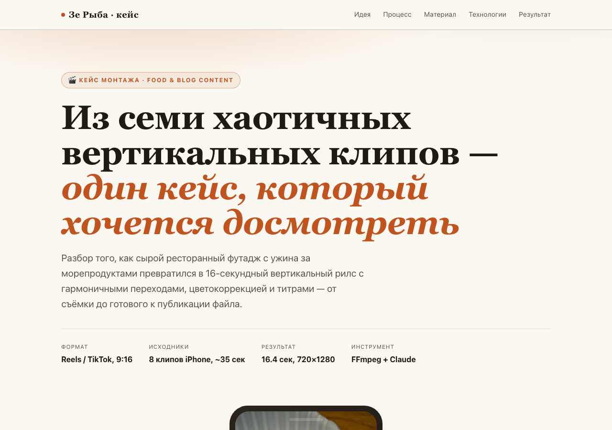

# Зе Рыба — кейс монтажа

Кейс о том, как из восьми сырых вертикальных клипов, снятых в ресторане, собран 16-секундный рилс для блога: идея, задача, этапы монтажа и технический разбор FFmpeg-пайплайна.

**Живая страница:** будет доступна на GitHub Pages после деплоя (см. Settings → Pages в этом репозитории).

## Структура

- `index.html` — страница кейса (одностраничник)
- `assets/reel.mp4` — финальный смонтированный ролик
- `assets/still-*.jpg` — стоп-кадры блюд, вошедших в ролик
- `assets/poster.jpg` — постер-кадр для видеоплеера

## Стек

FFmpeg (через пакет `imageio-ffmpeg`) — обрезка, `xfade`-переходы, цветокоррекция, кириллические титры через `drawtext`, кроссфейды и нормализация звука `loudnorm`. Никакого GUI-редактора — весь монтаж как один `filter_complex`.
